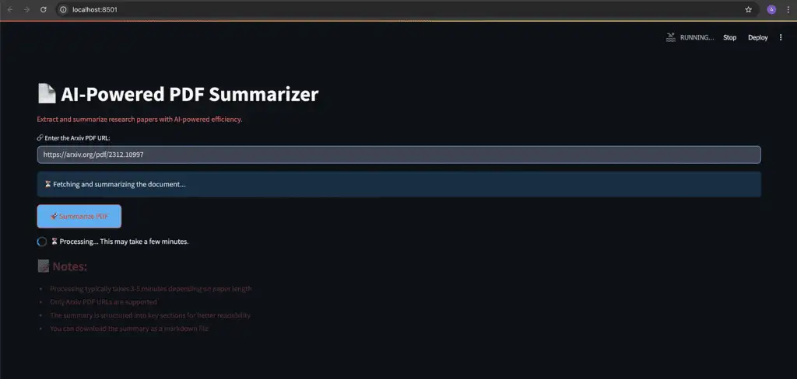

# 📄 AI PDF Summarizer

An advanced tool for extracting and summarizing **ArXiv PDF documents** using **Python**, **FastAPI**, **Streamlit**, and **Ollama (Gemma 3 LLM)**. This app delivers structured, downloadable summaries to help users quickly understand complex research papers without reading every word.

---

## 🚀 Features

- 📥 **PDF Text Extraction** – Parses and cleans PDF text using PyMuPDF.
- 🤖 **LLM-Based Summarization** – Uses Ollama with Gemma 3 to perform extractive and abstractive summarization.
- 📋 **Structured Summaries** – Organized into sections: Architecture, Implementation, Performance, etc.
- 🧠 **Parallel Chunk Processing** – Text is split and processed concurrently with retry logic.
- 🧪 **FastAPI Backend** – Lightweight RESTful API for document processing.
- 🌐 **Streamlit Frontend** – Sleek UI for uploading, viewing, and downloading summaries.
- 🔁 **Retry & Timeout Handling** – Robust error management for large documents.
- 📂 **Markdown Export** – Download the summary as a portable `.md` file.

---

## 🛠️ Tech Stack

| Component     | Purpose                                |
|---------------|----------------------------------------|
| `FastAPI`     | Backend API for document parsing       |
| `Streamlit`   | Frontend interface                     |
| `Ollama`      | Local LLM inference (Gemma 3 model)    |
| `LangChain`   | Chunking and token management          |
| `PyMuPDF`     | PDF parsing and text extraction        |
| `HTTPX`       | Async HTTP client for Ollama           |
| `Pydantic`    | API request validation                 |
| `Uvicorn`     | ASGI server to run FastAPI app         |

---

## 📦 Installation

1. **Clone the repository**
   ```bash
   git clone https://github.com/your-username/ai-pdf-summarizer.git
   cd ai-pdf-summarizer
   ```

2. **Install Python dependencies**
   ```bash
   pip install -r requirements.txt
   ```

3. **Install Ollama & Pull Gemma 3**
   ```bash
   curl -fsSL https://ollama.com/install.sh | sh
   ollama pull gemma3:27b
   ```

---

## 🔧 Run the Application

### ✅ Start FastAPI backend
```bash
uvicorn main:app --reload --port 8000
```

### ✅ Start Streamlit frontend
```bash
streamlit run frontend.py
```

Access the frontend at `http://localhost:8501` and enter a valid ArXiv PDF URL.

---

## 🧠 How It Works

1. 📎 Input: User enters an ArXiv PDF link.
2. 📄 Extraction: PDF downloaded and parsed using PyMuPDF.
3. ✂️ Chunking: LangChain splits the text into logical segments.
4. 🧠 Summarization: Each chunk summarized with Gemma 3 via Ollama.
5. 📘 Compilation: Summaries merged into a final, structured markdown.
6. 💾 Output: Summary shown in browser and available for download.

---

## 📸 Sample UI


---

## 📝 Notes

- Only **ArXiv PDF URLs** are currently supported.
- Average processing time: **2–5 minutes** depending on document length.
- Final summary is structured into technical sections.
- Ollama must be running locally to enable LLM summarization.

---
